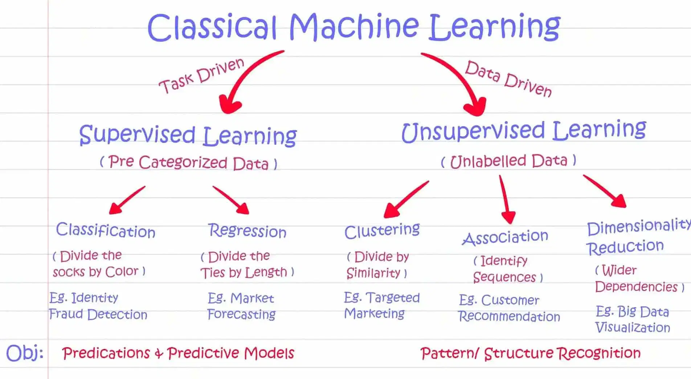
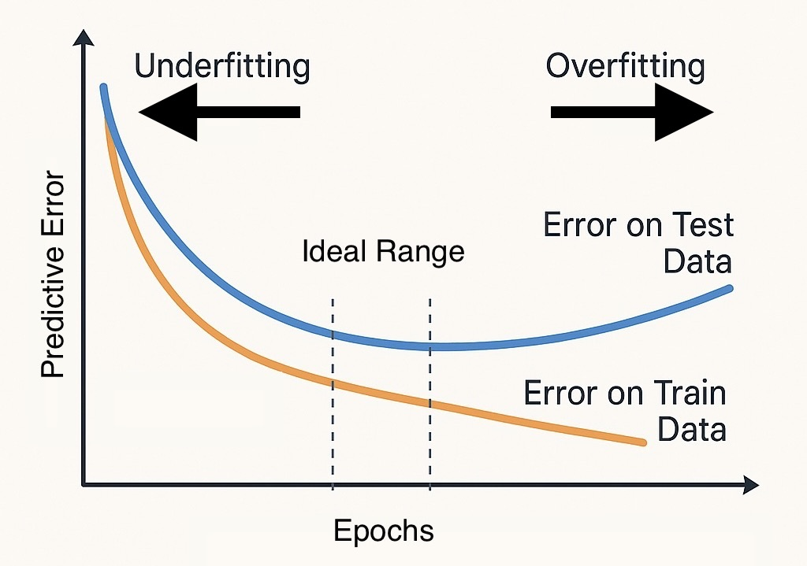

# Aprendizaje Automático Nivel 2 🚀

## Índice

1. [Resumen](#1-resumen)
2. [Objetivos de aprendizaje](#2-objetivos-de-aprendizaje)
3. [Descripción general del aprendizaje automático clásico](#3-descripción-general-del-aprendizaje-automático-clásico)
    - [Aprendizaje supervisado](#aprendizaje-supervisado)
    - [Aprendizaje no supervisado](#aprendizaje-no-supervisado)
4. [Entrenamiento de un modelo simple de aprendizaje automático](#4-entrenamiento-de-un-modelo-simple-de-aprendizaje-automático)
5. [Métricas de rendimiento](#5-métricas-de-rendimiento)
6. [Validación cruzada](#6-validación-cruzada)
7. [Evaluación del Modelo y Ajuste de Hiperparámetros](#7-evaluación-del-modelo-y-ajuste-de-hiperparámetros)
    - [Evaluación del modelo](#evaluación-del-modelo)
    - [Ajuste de hiperparámetros](#ajuste-de-hiperparámetros)
8. [Conclusión y Próximos pasos](#8-conclusión-y-próximos-pasos)

## 1. Resumen

En el Nivel 1, sentamos las bases del aprendizaje automático centrándonos en las etapas iniciales de cualquier proyecto de ML: comprender qué es el aprendizaje automático y cómo preparar los datos para el modelado.

La semana pasada, exploramos:

- ✅ ¿Qué es el aprendizaje automático?
- ✅ Cómo depurar y transformar datos sin procesar en un formato utilizable
  - Trabajo con archivos CSV, gestión de valores faltantes, eliminación de valores atípicos y visualización básica de datos
  - Escalado de características numéricas y codificación de variables categóricas
- ✅ La importancia de la ética, la equidad y los valores humanos en la construcción de sistemas de IA responsables

Esta semana, iremos más allá de la preparación de datos y hablaremos sobre las etapas restantes del proceso de aprendizaje automático.

- Cómo elegir y entrenar un modelo
- Cómo evaluar el rendimiento del modelo utilizando las métricas adecuadas
- Cómo usar la validación cruzada para garantizar resultados fiables
- Cómo perfeccionar tu modelo mediante la optimización de hiperparámetros
- Y, por último, cómo preparar tu modelo para su presentación o implementación

Al finalizar, comprenderás cómo convertir un proyecto desde datos sin procesar hasta un modelo de aprendizaje automático completamente entrenado y probado.

## 2. Objetivos de aprendizaje

- Comprender las categorías básicas de los modelos de aprendizaje automático
- Distinguir entre regresión y clasificación
- Reconocer problemas de aprendizaje no supervisado
- Entrenar y evaluar un modelo simple
- Entender qué es la validación cruzada y por qué es importante


## 3. Descripción general del aprendizaje automático clásico

El aprendizaje automático clásico se refiere a un grupo de algoritmos y técnicas fundamentales que se desarrollaron antes del rápido crecimiento del aprendizaje profundo y las redes neuronales. Estos métodos se siguen utilizando ampliamente hoy en día gracias a su rapidez, fácil interpretación y eficacia para resolver numerosos problemas del mundo real.

<kbd></kbd>

**Tipos de aprendizaje en el aprendizaje automático clásico:**

En el aprendizaje automático clásico, existen varios tipos de métodos de aprendizaje. Los dos más comunes son el **Supervised Learning** y el **Unsupervised Learning**, pero también existen otros, como el **Semi-Supervised** y el **Reinforcement Learning**, que desempeñan un papel importante en situaciones específicas.

---

### Aprendizaje supervisado 

El aprendizaje supervisado utiliza **datos etiquetados**, lo que significa que cada ejemplo de entrenamiento incluye tanto características de entrada como una salida correcta (etiqueta).

📌 **Objetivo:** Aprender una función que asigne entradas a salidas.

📌 **Ejemplo:** Predecir el precio de las viviendas basándose en características como el tamaño, la ubicación y el número de habitaciones.

Los algoritmos de aprendizaje supervisado se dividen en dos categorías según el tipo de salida:

**1) Classification Algorithms (Predecir categorías discretas)**
- Logistic Regression  
- Support Vector Machines (SVM)  
- k-Nearest Neighbors (k-NN)  
- Decision Trees  
- Random Forest  
- Naive Bayes  
- Gradient Boosting (XGBoost, AdaBoost, etc..)

**2) Regression Algorithms (Predecir valores continuos)**
- Linear Regression  
- Ridge/Lasso Regression  
- Support Vector Regression (SVR)  
- Decision Tree Regressor  
- Random Forest Regressor  
- k-Nearest Neighbors (k-NN) Regression

### Aprendizaje no supervisado

El aprendizaje no supervisado funciona con "datos no etiquetados". El algoritmo intenta encontrar patrones, agrupaciones o estructuras en los datos sin conocer de antemano el resultado correcto.

<kbd></kbd>

📌 **Objetivo:** Descubrir estructuras o relaciones ocultas en los datos

📌 **Ejemplo:** Segmentar a los clientes en diferentes grupos según su comportamiento de compra

📌 **¿Cómo reconocerlo?** No hay una columna de "objetivo" o el objetivo es agrupar, comprimir o resumir los datos

El aprendizaje no supervisado incluye las siguientes categorías:

#### 1) Clustering Algorithms 

Los algoritmos de agrupamiento se utilizan para agrupar automáticamente puntos de datos en grupos según su similitud, sin necesidad de datos etiquetados.

- K-Means  
- Hierarchical Clustering  
- DBSCAN  
- Mean Shift

#### 2) Dimensionality Reduction Algorithms 

Las técnicas de reducción de dimensionalidad simplifican los conjuntos de datos al reducir la cantidad de características de entrada y, al mismo tiempo, preservar información y patrones importantes.

- Principal Component Analysis (PCA)  
- t-SNE  
- Autoencoders *(transitions into deep learning)*  
- Factor Analysis

<kbd></kbd>

#### 3) Association Rule Learning 

El aprendizaje de reglas de asociación encuentra relaciones y patrones entre variables en grandes conjuntos de datos.

- Apriori  
- Eclat

---

Todos estos algoritmos implican mucha matemática y razonamiento. Esta es una de las partes más fáciles de **implementar**, pero una de las más difíciles de **comprender a fondo**. Para aprender más, puedes explorar explicaciones visuales, tutoriales en línea o profundizar en la teoría para comprender cómo y por qué funcionan en la práctica.

[Explicación matemática y visual de algunos algoritmos](https://mlu-explain.github.io/)


### Otros tipos de aprendizaje

**Aprendizaje semisupervisado:** combina una pequeña cantidad de datos etiquetados con una gran cantidad de datos sin etiquetar. Esto es útil cuando el etiquetado es costoso o requiere mucho tiempo, y aun así queremos aprovechar las ventajas del aprendizaje supervisado.

**Aprendizaje por refuerzo:** implica que un modelo aprende interactuando con un entorno y recibiendo recompensas o penalizaciones. Aunque es menos común en el aprendizaje automático clásico, se utiliza ampliamente en áreas como la robótica, los agentes de videojuegos y los sistemas de recomendación.

## 4. Entrenamiento de un modelo simple de aprendizaje automático

Ahora viene la parte divertida: ¡entrenar un modelo de aprendizaje automático!

Una vez que los datos estén limpios, transformados y listos, el proceso de codificación es sorprendentemente sencillo. En muchos casos, solo se necesita una sola importación y unas pocas líneas de código para comenzar.

### Pasos típicos para entrenar un modelo:

1. **Dividir los datos**: Divide tu conjunto de datos en conjuntos de entrenamiento y de prueba.
2. **Define el objetivo**: Determina si tu problema es *supervisado* o *no supervisado*.
3. **Elige un algoritmo**: Según tu objetivo, selecciona algunos modelos aplicables para probar.
4. **Entrenamiento y prueba**: Entrena el modelo con tus datos de entrenamiento y luego pruébalo con los datos de prueba no vistos.
5. **Evaluación del rendimiento**: Utiliza métricas como **exactitud**, **precisión** o **error cuadrático medio** para decidir qué modelo funciona mejor.

Es común probar varios modelos y comparar su rendimiento antes de elegir el mejor.

---

### Ejemplo: K-Nearest Neighbors Classifier

```python
from sklearn.model_selection import train_test_split
from sklearn.neighbors import KNeighborsClassifier
from sklearn.metrics import accuracy_score

# Dividir los datos en conjuntos de entrenamiento y prueba
X_train, X_test, y_train, y_test = train_test_split(X, y, test_size=0.2, random_state=5)

# Crear y entrenar al modelo.
model = KNeighborsClassifier(n_neighbors=3)
model.fit(X_train, y_train)

# Hacer predicciones y evaluar
y_pred = model.predict(X_test)
print("Accuracy:", accuracy_score(y_test, y_pred))
```
## 5. Métricas de Rendimiento

Tras entrenar un modelo, necesitamos una forma de medir su rendimiento. Aquí es donde entran en juego las **métricas de rendimiento**. La métrica adecuada depende del tipo de problema y de lo que más importa en tu caso de uso específico.

No todos los "buenos" resultados significan lo mismo. Un modelo puede parecer excelente a primera vista, pero fallar en las áreas más importantes para tu objetivo.


**Ejemplo 1: Filtro de spam (Clasificación):**

Supongamos que estás creando un modelo para detectar correos spam.

- **Precisión** = Cuántos correos acertó el modelo en total.
  Si tu modelo tiene una precisión del 95%, ¡genial!

Pero ¿qué pasa si el modelo omite mucho spam o, peor aún, marca correos reales como spam?

Aquí entran en juego otras dos métricas:

- **Precisión** = De los correos marcados como spam, ¿cuántos eran realmente spam?
  Una alta precisión significa menos **falsas alarmas**.

- **Recordatorio** = De todos los correos spam reales, ¿cuántos detectó el modelo?
  Un alto recordatorio significa menos **spam omitido**.

📌 **Si no hay problema con no detectar el spam, pero marcar correos electrónicos reales como spam es un problema, opta por una alta precisión.**

📌 **Si detectar todo el spam es fundamental (incluso si algunos correos electrónicos reales están marcados incorrectamente), opta por una alta capacidad de recuperación.**


**Ejemplo 2: Predicción del precio de la vivienda (Regresión):**

Ahora imagina que estás prediciendo el precio de la vivienda. El modelo indica que una casa vale **$300,000**, pero el valor real es **$310,000**. Eso supone un **error de $10,000**.

Utilizamos estas métricas para medir la desviación de las predicciones:

- **MAE (Error Absoluto Medio)** = En promedio, ¿cuántos dólares nos desviamos? 
- **MSE (Error Cuadrático Medio)** = La misma idea, pero **los errores más grandes se penalizan más** porque se elevan al cuadrado.
- **RMSE (Error Cuadrático Medio)** = Similar al MSE, pero restablece el resultado en las unidades originales (como dólares).
- **Puntuación R²** = Cuantifica qué tan bien se alinean las predicciones de un modelo de regresión con los datos reales (cuanto más cerca de 1, mejor).

📌 **Si los errores pequeños son aceptables**, use MAE.

📌 **Si los errores grandes son realmente graves**, use MSE o RMSE para penalizarlos más.

📌 **Si desea saber cuánta varianza explica su modelo**, use R².

El objetivo es elegir siempre la métrica que coincida con el **impacto real** de sus predicciones. Un buen modelo en un caso puede no ser adecuado para otro, dependiendo de qué errores sean más importantes.

## 6. Validación cruzada

En nuestro ejemplo anterior, utilizamos un enfoque común: dividir el conjunto de datos en dos partes: una para entrenamiento y otra para pruebas. Si bien esto es simple y ampliamente utilizado, presenta un problema. Una sola división entre entrenamiento y prueba puede ser **poco fiable**, especialmente con conjuntos de datos pequeños. El rendimiento del modelo puede variar significativamente según cómo se dividan los datos.

Aquí es donde entra en juego la **Validación cruzada**.

<kbd></kbd>

La validación cruzada es un método más **robusto y fiable** para evaluar un modelo de aprendizaje automático. En lugar de entrenar y probar el modelo una sola vez, la validación cruzada divide los datos en varias partes (denominadas **folds**). El modelo se entrena y prueba varias veces, cada vez utilizando un fold diferente para las pruebas y el resto para el entrenamiento.

Al final, se promedian los resultados de cada ejecución para obtener una estimación más estable y precisa del rendimiento del modelo.

- Proporciona una **mejor estimación** del rendimiento del modelo
- Ayuda a **prevenir el sobreajuste**
- **Reduce la varianza** causada por divisiones aleatorias entre entrenamiento y prueba

La validación cruzada es especialmente importante al ajustar hiperparámetros o comparar diferentes modelos. Garantiza que el rendimiento observado no sea solo el resultado de una división fortuita de datos.

## 7. Evaluación del Modelo y Ajuste de Hiperparámetros

Entrenar un modelo es solo el comienzo. Después, los siguientes pasos son:

- **Evaluar su rendimiento**
- **Mejorarlo mediante ajustes**

---

### Evaluación del Modelo

Una vez elegido un modelo y entrenado, es necesario evaluar su rendimiento. Esto implica analizar las **métricas de rendimiento** (como la exactitud, la precisión o el MAE) y detectar problemas como:

- **Sobreajuste**: El modelo funciona muy bien con los datos de entrenamiento, pero mal con los datos no analizados.
- **Subajuste**: El modelo funciona mal tanto con los datos de entrenamiento como con los de prueba porque no ha aprendido lo suficiente.  

<kbd></kbd>

En esta figura, las líneas representan nuestro modelo (o función) y los puntos son nuestros datos. Cada escenario muestra la capacidad de generalización del modelo (su capacidad para realizar predicciones precisas con datos nuevos e inéditos).

Esto significa que, al introducir un nuevo dato que el modelo no ha visto antes, queremos que realice una predicción lo más cercana posible al valor real.

- En el caso de sobreajuste, el modelo es demasiado complejo e intenta ajustar cada punto de los datos de entrenamiento, incluso el ruido. Si bien puede funcionar muy bien con el conjunto de entrenamiento, no logra generalizar y su rendimiento es deficiente con datos nuevos.

- En el caso de subajuste, el modelo es demasiado simple y no captura el patrón subyacente en los datos. Su rendimiento es deficiente tanto con los datos de entrenamiento como con los nuevos porque no ha aprendido lo suficiente.

- En el ajuste ideal, el modelo captura el verdadero patrón subyacente sin complicar las cosas. Su rendimiento es bueno tanto con los datos de entrenamiento como con los nuevos, mostrando una buena generalización.

El objetivo es encontrar el equilibrio adecuado, donde el modelo sea lo suficientemente complejo como para aprender los patrones importantes, pero no tan complejo como para memorizar los datos.

**Cómo implementar:**
Para detectar estos problemas, utilice gráficos como las curvas de precisión o error durante el entrenamiento.

<kbd></kbd>

```python
import numpy as np
import matplotlib.pyplot as plt
from sklearn.model_selection import learning_curve
from sklearn.datasets import load_iris
from sklearn.linear_model import LogisticRegression

# Tenemos nuestras características y objetivo
X = df.drop[columns='target']
y = df['target']

# Elige un modelo simple
model = LogisticRegression(max_iter=200)

# Obtener datos de la curva de aprendizaje
train_sizes, train_scores, val_scores = learning_curve(
    model, X, y, cv=5, scoring='accuracy'
)

# Calcular puntuaciones promedio en todos los pliegues
train_scores_mean = np.mean(train_scores, axis=1)
val_scores_mean = np.mean(val_scores, axis=1)

# Trazar los gráficos
plt.plot(train_sizes, train_scores_mean, label='Training Score')
plt.plot(train_sizes, val_scores_mean, label='Validation Score')
plt.xlabel('Training Set Size')
plt.ylabel('Accuracy')
plt.title('Learning Curve')
plt.legend()
plt.grid(True)
plt.show()
```
---

### Ajuste de hiperparámetros

Cada modelo tiene parámetros ajustables, llamados *hiperparámetros*. Estos no se aprenden de los datos, sino que se definen antes de comenzar el entrenamiento.

#### Ejemplo:
Para *K-Nearest Neighbors (KNN)*, un hiperparámetro clave es:

- `n_neighbors`: ¿Cuántos puntos cercanos debe considerar el modelo?

Puede probar diferentes valores, como 3, 5 o 7, y comparar su precisión.

### Hiperparámetros comunes por modelo

| Model              | Common Hyperparameters                    |
|-------------------|--------------------------------------------|
| KNN                | `n_neighbors`                              |
| Decision Tree      | `max_depth`, `min_samples_split`           |
| Random Forest      | `n_estimators`, `max_depth`                |
| SVM                | `C`, `kernel`, `gamma`                     |
| Gradient Boosting  | `learning_rate`, `n_estimators`, `max_depth` |

La parte más difícil del ajuste de hiperparámetros es comprender **qué hiperparámetros ajustar y por qué**. Esto requiere una comprensión más profunda del funcionamiento interno de cada algoritmo de aprendizaje automático, y profundizar en ello sería demasiado extenso para esta presentación.

En su lugar, recomiendo empezar por algo sencillo:

Elige **un algoritmo** que estés usando y búscalo en línea para ver qué es y cómo funciona. Luego, consulta la **documentación de Scikit-learn** para ver qué hiperparámetros están disponibles y qué controlan.

Céntrate en comprender algunos **hiperparámetros clave** que suelen afectar el comportamiento del modelo y experimenta modificando ligeramente sus valores. Esto te ayudará a ver cómo pequeños ajustes pueden afectar la precisión, el sobreajuste o el subajuste del modelo.

A medida que te sientas más cómodo, empezarás a reconocer qué hiperparámetros son más importantes para los diferentes tipos de problemas.

Por ahora, solo recuerda:
- Los **hiperparámetros** son ajustes que defines antes de entrenar tu modelo (como `n_neighbors` en KNN). - Son diferentes de los **parámetros**, que el modelo aprende durante el entrenamiento.

### ¿Cómo ajustar?

Normalmente combinamos el ajuste de hiperparámetros con la **Validación cruzada**, utilizando herramientas como la **Grid Search**.

La Búsqueda en cuadrícula es un método que prueba automáticamente todas las combinaciones posibles de valores de hiperparámetros para encontrar la configuración del modelo con mejor rendimiento.

#### Ejemplo de Gridsearch:

```python
from sklearn.model_selection import GridSearchCV
from sklearn.neighbors import KNeighborsClassifier

params = {'n_neighbors': [3, 5, 7, 9]}
grid = GridSearchCV(KNeighborsClassifier(), params, cv=5)
grid.fit(X_train, y_train)

print("Best Parameters:", grid.best_params_)
print("Best Score:", grid.best_score_)
```

## 8. Conclusión y Próximos pasos

En este punto, has completado **todo el proceso de aprendizaje automático** de principio a fin:

- Exploraste y depuraste tus datos
- Los transformaste para que estuvieran listos para el modelo
- Elegiste los algoritmos adecuados
- Entrenaste y evaluaste múltiples modelos
- Los ajustaste para mejorar el rendimiento

Ahora solo queda **comunicar tus resultados** de forma clara e impactante, ya sea mediante un panel, un informe o una presentación. Presentar tus hallazgos eficazmente es el paso final que demuestra el valor de todo lo que has hecho.


#### ¿Qué sigue?

Ahora que ha completado el ciclo completo de modelado, desde la preparación de datos hasta el entrenamiento, la evaluación y el ajuste de los modelos, ha construido una base sólida en el aprendizaje automático clásico.

En la próxima presentación, profundizaremos en varios temas clave que hemos abordado y exploraremos nuevos conceptos.

Analizaremos **técnicas avanzadas de limpieza de datos** para gestionar conjuntos de datos reales desordenados, incluyendo métodos más inteligentes para gestionar valores atípicos, valores faltantes y datos con ruido.

También se presentarán **técnicas de reducción de dimensionalidad**, como el **Análisis de Componentes Principales (PCA)**, que ayudan a simplificar conjuntos de datos complejos a la vez que preservan la información más importante.

También presentaremos las **neural networks**, explicando cómo imitan el cerebro para resolver problemas más complejos y por qué se han convertido en la base de la inteligencia artificial moderna.

Por último, cubriremos los **pipelines**, que ayudan a automatizar y organizar todo el flujo de trabajo de aprendizaje automático.


